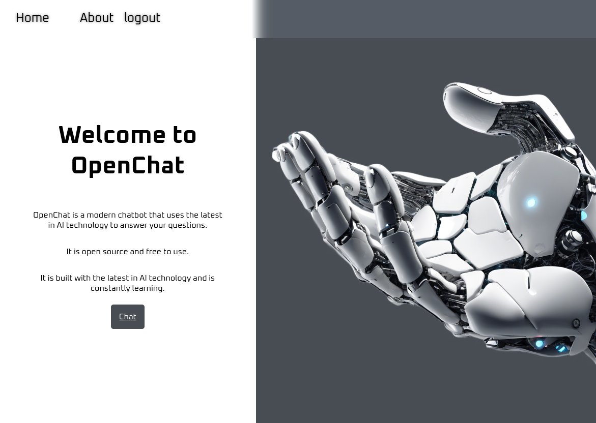

# openchat

## running local
For local development, you can use the following command to start the server:

### 1. option: easy way
Due to the interconnection of 4 different servers (sveltekit, server-go, python-api and mongo),
I recommend using Docker Compose to facilitate local execution.  

```bash
cd local
docker-compose build
docker-compose up
```

### 2. option: manual way
Otherwise would be needed all the servers running in different terminals, 
and setting the environment variables for each one.


fish shell example:
```bash
# sveltekit
# Dont forget to set the environment variable for the sveltekit server (using the .env file) 
cd sveltekit
npm install
npm run dev
```

```bash
# server-go
cd server-go
go run main.go
```

I suggest to use virtual enviroment for the python-api server,
```bash
# python-api
cd python-api
python3 -m venv venv
source venv/bin/activate # For windows use venv\Scripts\activate
pip install -r requirements.txt
python app.py
```
lastly need to have a mongo server running, I suggest use docker for that. Otherwise you can install it locally a set it.
```bash
# mongo
docker run -d -p 27017:27017 mongo
```

# Images of project
## index page

## About page

## Chat page
